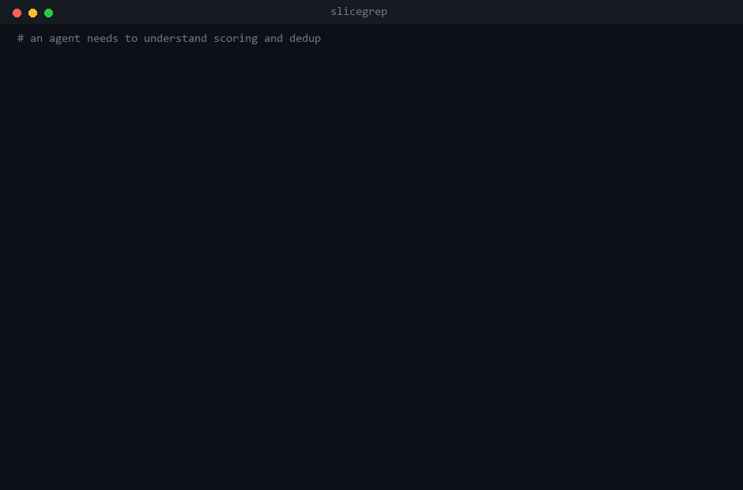

# slicegrep

grep that gives back ranked, token-budgeted code slices instead of whole files.



[Longer demo](docs/demo.gif) covering directory ranking, plain-English
queries, negative evidence, and the hook.

## Why I built this

If you watch a coding agent work for ten minutes you'll see the same loop
over and over. It greps, gets back a pile of line numbers with no context,
opens three whole files to make sense of them, and then does it all again for
the next question. Most of what ends up in the context window is code nobody
asked about, and it doesn't leave. It just sits there crowding out the stuff
that mattered.

grep gives you matches with no context. Opening the file gives you context
plus a few thousand tokens of noise. I wanted the thing in between: the few
slices that actually answer the question, best ones first, capped at a size I
pick.

So that's what this is. Point it at a file or a directory, it pulls the
relevant slices, ranks them, throws out near-duplicates, trims to a token
budget, and tells you what it couldn't find.

```bash
pip install git+https://github.com/haxo98098/slicegrep
```

Core is standard library only. Python 3.8 and up.

## Making it automatic

Here's the thing I got wrong at first. Giving an agent a better tool isn't
enough, because it has to remember to reach for it, and mostly it doesn't. It
reaches for the plain file read out of habit.

So there's a plugin that takes the decision away. A hook sits in front of the
Read tool, and when a read is big enough to be worth it, the whole file gets
swapped out for a map of the file plus the slices matching whatever you're
working on right now.

```
/plugin marketplace add haxo98098/slicegrep
/plugin install slicegrep@slicegrep
```

Nothing to install, it runs the bundled source. On this repo's own `core.py`
that's a 17,849 token read turned into 2,195 tokens of map plus slices.

I leave this running on my own machine, so it's built not to ruin my day:

1. **It fails open.** Any error, any unreadable path, any empty result, and
   your normal read just happens. A retrieval tool should never be able to
   break your session.
2. **It won't trap you.** Read the same file twice and the second one goes
   straight through, and the injected text tells you that. If the slices
   weren't enough, asking again gets you the whole file.
3. **It only fires when it's worth it.** Small files, ranged reads, and
   non-code files pass through untouched. I measured the median real-world
   read at around 600 tokens, and there's nothing to save there. The cost is
   all in the tail.

It also corrects itself. A fixed budget is really just a guess about how
dense a file is, and when the guess is wrong you get back a sliver. So the
hook checks its own coverage, and if it returned less than 55% of what
matched it doubles the budget and tries again, up to a ceiling. The ceiling
matters. A hook that grows without limit is just a whole-file read wearing a
hat.

Anything still missing comes back with the exact arguments to go get it:

```
STILL NOT SHOWN (38% of matched material above).
To see any of these, Read core.py with offset/limit:
  offset=394  limit=104   (~1028 tok, score=32)
  offset=524  limit=219   (~2185 tok, score=31)
```

So your next move is a precise ranged read, not re-reading the whole file.

Knobs: `SLICEGREP_HOOK_MIN_TOKENS` (2000), `SLICEGREP_HOOK_BUDGET` (1200),
`SLICEGREP_HOOK_MIN_COVERAGE` (0.55), `SLICEGREP_HOOK_MAX_BUDGET` (4000),
`SLICEGREP_HOOK_TIMEOUT` (5s), and `SLICEGREP_HOOK_DISABLE=1` to switch it
off. If your Python isn't on PATH as `python`, edit the command in
`hooks/hooks.json`.

## Using it yourself

```bash
# find a function
slicegrep src/app.py "def handle_request"

# whole enclosing blocks, searched recursively, under a token budget
slicegrep src/ "Scorer|def score" --boundary fn --budget 800

# co-occurring concepts, a chunk matching more of them ranks higher
slicegrep . "retry|timeout|backoff" --budget 1500

# raw JSON for tooling
slicegrep src/ "TODO" 2 2 --json
```

`fr` is installed as a shorter alias, for focused read.

Plain English works too. `"def score|budget"` is fine, and so is
`"how does budget packing guarantee definitions"`. Anything with three or
more content words gets expanded with stemming and subword matching, which is
what closes the vocabulary gap when you don't know the exact identifier.

From Python:

```python
from slicegrep import focused_read

result = focused_read("src/", "class Scorer|def score", budget=800, boundary="fn")

print(result.render())          # the ranked text report an LLM reads
print(result.total_tokens)      # e.g. 612
for chunk in result.chunks:
    print(chunk.file, chunk.line_start, chunk.score, chunk.rank_reason)

data = result.to_dict()         # structured output for your own pipeline
```

## One task, both ways

Hit rate tables don't tell you what the difference feels like. So here's a
single realistic bug hunt run both ways, scored on the three things you
actually need to fix something: the definition, a caller in another file, and
the test.

You can run this yourself. It takes two commands, and the first one checks
out the exact upstream revisions these numbers came from:

```bash
python benchmarks/setup_corpora.py --only click,flask,requests
python benchmarks/compare_one.py --task echo
```

Each corpus is pinned to a full commit SHA, not just a tag, and the setup
script verifies what it actually checked out. If a maintainer has moved a tag
since, it says so loudly rather than quietly handing you numbers that can't
be compared to these. `--corpora PATH` or `SLICEGREP_BENCH_CORPORA` point it
at checkouts you already have.

**"echo() mangles unicode on Windows. Where is it defined, who calls it, and
what covers it?"** (click)

| | tool calls | tokens | definition | caller | test |
|---|---|---|---|---|---|
| grep → read → read → grep | 4 | 14,233 | yes | yes | **no** |
| slicegrep | **1** | **2,614** | yes | yes | **yes** |

Same question, two other repos:

| task | baseline | slicegrep | saved |
|---|---|---|---|
| `url_for` (flask) | 4 calls, 22,815 tok, all three | 1 call, 2,763 tok, all three | 88% |
| `Session.request` (requests) | 4 calls, 8,826 tok, **no test** | 1 call, 2,710 tok, all three | 69% |

Two things jump out, and one of them isn't flattering:

The baseline keeps finding the definition and a caller and missing the test.
That's not bad luck. Opening the two most promising grep hits gets you the
implementation, and nothing in that loop ever goes looking for coverage. The
budget packer reserves a slot for a test chunk, which is the only reason it
lands one in a single call.

And the token gap is mostly just about whole files. The baseline pays full
price for two files to use a few regions of each. That's the whole thesis,
and it's also why the win shrinks on small files and grows on big ones.

Worth saying plainly: slicegrep is showing 4% to 36% of matched material in
those runs. It gets the three things that matter because of the guarantees,
not because it saw everything.

## Does it actually work

I got sick of retrieval projects reporting numbers from the same data they
were tuned on, so this one holds data back. Tuning and validation seeds get
burned during development, and anything published here comes from
confirmation runs on untouched data with every previously used session
excluded, against a frozen engine, run once. Two router bugs got caught that
way, and the seeds they cost are written down in the CHANGELOG instead of
quietly recycled.

**Real-change retrieval, 286 fresh sessions.** Real commits mined from click,
flask, requests and rich. The repo gets rebuilt at the parent commit so no
future information leaks in, the query is the commit message and nothing
else, and a hit means pulling back at least half the regions the real fix
touched under an 8k cap.

| strategy | hit rate | 95% CI | mean coverage |
|---|---|---|---|
| dense embeddings (potion-code) | 28.3% | [23.1, 33.5] | 25.0% |
| **slicegrep** | **26.6%** | [21.5, 31.7] | 24.2% |
| tf-idf windows | 23.4% | [18.5, 28.3] | 21.6% |
| grep + file ranking | 23.4% | [18.5, 28.3] | 21.6% |
| ast-chunk tf-idf | 22.0% | [17.2, 26.8] | 20.5% |
| bm25 windows | 21.7% | [16.9, 26.5] | 20.2% |

That's a statistical tie for first, not a win, and I'd rather say so than
round it in my favour. Both are clear of everything else. slicegrep is the
only one up there that also hands back line-attributed slices, negative
evidence, and guaranteed definition plus caller plus test, and it's the one
that wins the suite below.

**Controlled retrieval suite, fresh seed, 240 tasks.** Six task families
(symbol lookup, docstring concepts, cross-file call chains, bug localization
from error strings, config data flow, test plus implementation) against
twelve strategies.

| strategy | tokens to model | hit rate | tool calls |
|---|---|---|---|
| **slicegrep** | 2,304 | **71.4%** | 1 |
| bm25 windows | 2,213 | 66.1% | 1 |
| ast-chunk tf-idf | 2,296 | 58.6% | 1 |
| grep + window reads | 5,693 | 60.4% | 7 |
| semble (embeddings+BM25) | 2,094 | 44.5% | 1 |
| dense embeddings | 2,262 | 35.2% | 1 |

First by 5.3 points, at about 2.3k tokens and one call.

The other suites are in the RESULTS files: cross-language (zod 77.5% against
a next-best 60.0, serde 67.5% against 50.0, django at ~2,800 files still
first at 60.0), multi-turn, and an end-to-end run with real model calls where
it had the best mean file recall.

## How the ranking works

Precise queries (identifiers, error strings, one or two terms) go down the
lexical path: BM25 over definition-aligned blocks, the guaranteed objectives,
and diversity packing so one file can't hog the budget. Dense retrieval is
gated out of that path completely, because measuring it showed it waters down
precise packing. Vague queries keep the guarantees and then fill whatever
budget is left using a fused dense and BM25 ranking.

What pushes a slice up: matching several of your patterns, holding
distinctive identifiers instead of boilerplate, being where a symbol is
defined rather than just used, having several hits in one place. What pushes
it down: declaration-only matches, test files (unless you went looking for
tests), vendored or generated paths, and slices that are mostly comments.

The optional extras (model2vec for the dense stage, git history priors) drop
out quietly when they aren't around, which is what keeps the core free of
dependencies.

### How do you know it didn't cut something you needed

This is the obvious objection to anything that hands back 350 tokens where
there were 18,000, and "trust the ranking" isn't an answer. So nothing is
allowed to vanish quietly. Every region that matched your query either comes
back, or gets named in the report with where it is, how big it is, what it
scored, and why it lost:

```
OMITTED — 12 matching region(s), ~8610 tokens not returned (6% of matched material shown):
  core.py:102-192  ~925 tok  score=47.0  (multi_match(3), co_occurrence, all_patterns)
  cli.py:1-60      ~642 tok  score=41.0  (multi_match(3), co_occurrence)
  hook.py:219-235  ~127 tok  score=13    (semantic-recall)
  ... and 4 more
  -> raise --budget, or read these ranges directly.
```

Three things come out of that.

Coverage is stated instead of implied. "6% of matched material shown" is the
honest reading of a 700-token budget against that query. If that's too low
for what you're doing, raise the budget. What it won't do is pretend the
other 94% didn't exist.

You can always go get it. Omissions carry exact line ranges, so the next step
is a normal read of those lines rather than a fishing trip.

Truncation counts as loss too. When one region is bigger than the entire
budget it gets cut to fit, and the header used to keep claiming the full line
range while showing part of it. It now reports only the range it actually
returned and lists the rest as omitted. That was a genuine bug, and I found
it while writing the test for this section.

`result.coverage`, `result.omitted` and `result.omitted_tokens` are on the
Python object and in `--json`, so a harness can act on them instead of
guessing: raise the budget and retry, or go fetch the omitted ranges.

### An empty result is a real answer

Most search tools give you nothing back and leave you wondering whether the
thing doesn't exist or you just missed it. This one tells you which:

```
NEGATIVE EVIDENCE:
  - No definition found for 'Scorer' in src/
  - Pattern 'deprecated_api' not found in src/
```

It also separates "not in the file" from "in the file but it fell outside the
budget", which is what you need to know when you're deciding whether to raise
the budget or change the query.

## MCP server

If you'd rather the model called it as a tool:

```bash
pip install "slicegrep[mcp] @ git+https://github.com/haxo98098/slicegrep"
claude mcp add slicegrep -- slicegrep-mcp
```

Or in an MCP config file:

```json
{
  "mcpServers": {
    "slicegrep": {
      "command": "slicegrep-mcp"
    }
  }
}
```

Works with Claude Desktop, Claude Code, Cursor, Windsurf, or anything else
that speaks MCP. Needs Python 3.10 or newer.

## If a search seems to hang

Both of these were real, both are fixed, and both are worth knowing about
because they'll bite any regex-based retrieval tool.

**Catastrophic backtracking.** A pattern with a nested quantifier like
`(a+)+$` sends Python's regex engine into exponential backtracking. I
measured 197 seconds of CPU against a single 200-character line, and it was
still going when I killed it, because `re` has no timeout and simply never
comes back. Patterns get screened now. A query made only of those raises
immediately and tells you how to rewrite it, and a bad fragment inside a
bigger query degrades to a literal so the rest still works. Lines over 5,000
characters, which in practice means minified bundles, get skipped instead of
matched.

**The dense model reaching for the network.** Loading it can fetch from
HuggingFace on a cold cache. A refused connection raises an error, but a
stalled one just sits there, and from the outside that's indistinguishable
from a frozen search. It's bounded now by `SLICEGREP_DENSE_TIMEOUT` (15s) and
falls back to lexical only.

If you want speed, `SLICEGREP_DENSE=off` takes about 2.7s off a cold
directory search on a mid-size repo. A cold run over a 770-file tree is
roughly 7s, while warm calls are 35 to 60ms thanks to the in-process cache,
so a long-running MCP server pays that once rather than every query.

## CLI reference

```
slicegrep <path> <pattern> [before] [after] [options]

  <path>       file OR directory (a directory implies a recursive walk)
  <pattern>    case-insensitive regex; join alternatives with '|'
  before after context lines each side of a match (default 40 40)

options:
  --budget N        keep only the highest-ranked chunks fitting ~N tokens
  --boundary MODE   auto (fixed window) | fn (snap to enclosing function/class) | none
  --recursive, -r   force a directory walk even for a file path
  --no-dedupe       keep near-duplicate chunks (exact dups still collapse)
  --json            print raw JSON instead of the rendered report
  --version
```

Exit code is 0 when something matched and 1 when nothing did, so scripts and
CI can branch on it.

## Development

```bash
git clone https://github.com/haxo98098/slicegrep
cd slicegrep
pip install -e ".[dev,mcp]"
pytest
```

To reproduce any of the benchmark numbers, fetch the pinned corpora first:

```bash
python benchmarks/setup_corpora.py            # snapshots at pinned SHAs
python benchmarks/setup_corpora.py --full     # + full history, needed by bench3
python benchmarks/setup_corpora.py --verify   # check what you have
```

The corpora are other people's repositories, so they're cloned on demand and
never committed here.

The CHANGELOG records the experiments that failed next to the ones that
worked. Multiplicative history priors, adaptive budget splits, RRF packing
and a few others all lost to what's here, and it seemed worth keeping track
of what didn't pan out.

## License

[MIT](LICENSE)
